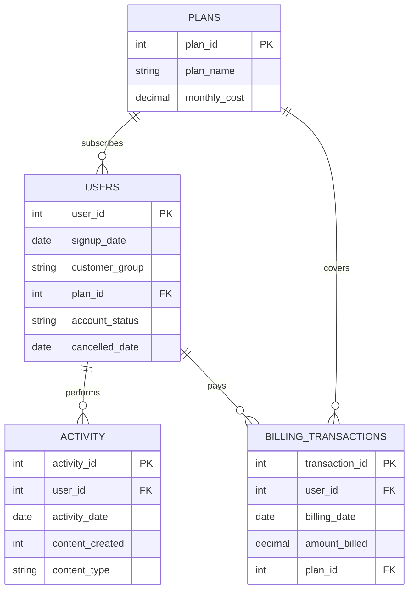

# VisionForge — Product Usage & Business Insights (SQL Analysis)

## 📌 Business Problem

<!-- TODO: Fill in 2-3 sentences describing VisionForge and why this analysis was needed -->
VisionForge is an AI-powered creative platform that helps businesses and independent creators produce visual content. Our platform has attracted a growing number of users, but the team is finding it difficult to understand what this growth really means. Some users return frequently and create a large amount of content, while others experiment with the platform briefly and do not return. Usage patterns also appear to differ across customer groups, plans, and periods. The leadership team wants to understand these patterns before deciding where to focus product and business efforts.

**Problem Statement:**
1.What information would help us understand meaningful product usage?
2.Which user or customer patterns are worth investigating?
3.What changes over time could reveal something important?
4.Which findings could help the business decide where to focus?

---

## 🗂️ Schema Overview

This analysis is built on 4 tables:

| Table | Purpose |
|---|---|
| `users` | Core user records — signup date, customer group, current plan, account status |
| `plans` | Subscription plan catalog — name and list price |
| `activity` | Daily content-creation activity per user |
| `billing_transactions` | Actual billed amounts per user per billing cycle |

### Table Definitions

<!-- TODO: Optionally paste your CREATE TABLE statements here for reference -->

**`users`**
| Column | Type | Notes |
|---|---|---|
| user_id | INT (PK) | |
| signup_date | DATE | |
| customer_group | VARCHAR(30) | e.g. Enterprise, SMB, Individual |
| plan_id | INT (FK → plans) | Reflects **current** plan only |
| account_status | VARCHAR(20) | e.g. active, cancelled |
| cancelled_date | DATE | NULL if not cancelled |

**`plans`**
| Column | Type | Notes |
|---|---|---|
| plan_id | INT (PK) | |
| plan_name | VARCHAR(30) | |
| monthly_cost | DECIMAL(10,2) | List price |

**`activity`**
| Column | Type | Notes |
|---|---|---|
| activity_id | INT (PK) | |
| user_id | INT (FK → users) | |
| activity_date | DATE | |
| content_created | INT | |
| content_type | VARCHAR(30) | e.g. image, video, template |

**`billing_transactions`**
| Column | Type | Notes |
|---|---|---|
| transaction_id | INT (PK) | |
| user_id | INT (FK → users) | |
| billing_date | DATE | |
| amount_billed | DECIMAL(10,2) | Actual amount charged |
| plan_id | INT (FK → plans) | Plan **at time of transaction** |

---

## 🔗 Entity Relationship Diagram



### Relationships

- **`plans` → `users`**: One plan can have many current subscribers (one-to-many)
- **`plans` → `billing_transactions`**: One plan can appear on many billing transactions (one-to-many)
- **`users` → `activity`**: One user has many activity records — one row per active day (one-to-many)
- **`users` → `billing_transactions`**: One user has many billing records — one row per billing cycle (one-to-many)
- **Note:** `activity` and `billing_transactions` have no direct relationship — they only connect through `users`.

---

## ⚠️ Assumptions

<!-- TODO: Add/edit any that don't match your final data -->
- "Meaningful usage" is defined as a user creating content (`content_created > 0`) on a given day — login/session activity alone is not tracked.
- `users.plan_id` reflects the user's **current** plan only. 
- `account_status` / `cancelled_date` capture explicit cancellations. A NULL `cancelled_date` on an active-labeled user does not by itself confirm current engagement.
- `billing_transactions.amount_billed` is the actual amount charged and may differ from `plans.monthly_cost` (list price) due to discounts or proration.
- `billing_transactions.plan_id` reflects the plan **at the time of that transaction** — it is not guaranteed to match `users.plan_id` today, since there is no history table linking the two over time.

---

## 🔍 Key Business Questions Explored

<!-- TODO: List the questions you actually answered, e.g. -->
1.How much revenue each customer generates
2.How much customers use the product
3.How actively customers use the product
4.Revenue generated relative to usage
5.How many customers remain active over time
6.How many customers leave/cancel(Churn rate)
7.How is customer value and engagement segmentation.


---

## 📊 Findings Summary


---

## ❓ Additional Business Question for Future Exploration

<!-- TODO: Fill in your chosen follow-up question and 1-2 lines on why it matters -->
[e.g. "Which customer groups are getting the least value per rupee of plan cost, and should pricing/plan design change for them?"]

---

## 🛠️ Tech Stack

- SQL (specify your DB: PostgreSQL / MySQL / SQL Server / etc.)
<!-- TODO: mention any tool used for the ER diagram, e.g. Mermaid, dbdiagram.io -->

---

=
```
